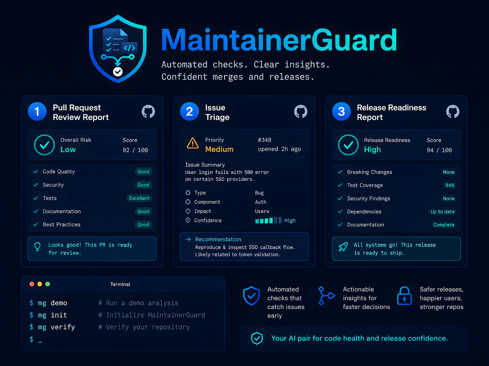

<p align="center">
  
</p>

<h1 align="center">MaintainerGuard</h1>

<p align="center">
  Evidence-first AI maintainer assistant for merge, security, issue, and release readiness.
</p>

<p align="center">
  <a href="https://github.com/xxxquide/MaintainerGuard/actions/workflows/ci.yml"></a>
  <a href="https://github.com/xxxquide/MaintainerGuard/releases/tag/v0.1.4"></a>
  <a href="https://github.com/marketplace/actions/maintainerguard"></a>
  <a href="pyproject.toml"></a>
  <a href="LICENSE"></a>
</p>

MaintainerGuard helps open-source maintainers turn pull-request metadata,
changed files, scanner outputs, repository policies, issue reports, and release
feeds into one concise maintainer report.

It answers the review question maintainers actually have:

> Can this pull request or release be safely reviewed, merged, or shipped, and
> what exactly should I verify before doing so?

MaintainerGuard is useful without AI. The deterministic evidence engine is the
source of truth. Optional AI can improve wording only after every retained claim
links to known evidence.

## Why evidence-first?

Maintainers already juggle diffs, CI, CodeQL, dependency scanners, secret
scanners, release notes, and local project rules. The hard part is not seeing
one more alert. The hard part is knowing what matters, why it matters, and what
to check before merging.

MaintainerGuard reduces that review noise into one report with:

- a verdict, risk level, confidence, and decision guidance;
- security-sensitive, dependency, supply-chain, test, docs, and release signals;
- scanner findings normalized into maintainer language;
- repository policy checks;
- a maintainer checklist;
- an evidence table for the claims that matter.

## What MaintainerGuard is not

MaintainerGuard is not:

- a replacement for human review;
- a guarantee of secure code;
- a vulnerability scanner that finds everything;
- an autonomous merge bot;
- a substitute for CodeQL, OSV, Semgrep, Gitleaks, or human security review;
- a system that posts noisy inline AI comments.

MaintainerGuard is:

- an evidence-first review assistant;
- a merge readiness reporter;
- a scanner result explainer;
- a maintainer checklist generator;
- a no-spam GitHub workflow helper.

## Core features

- Deterministic merge-readiness reports in Markdown or JSON
- Decision guidance such as `Request tests` or `Block until scanner finding is resolved`
- Security-sensitive change detection without vulnerability overclaims
- Dependency and supply-chain-sensitive file detection
- Scanner adapters for generic JSON, SARIF-like/code scanning, OSV-like advisories, secret scanner results, Semgrep-like static analysis, and workflow policy outputs
- Repository-specific policies with safe defaults
- Issue triage with safe handling for possible private security reports
- Release readiness reports with release verdict, checklist, and release notes draft
- Optional OpenAI Responses API enrichment with redaction and evidence validation
- GitHub dry-run mode and guarded update-one-comment publishing
- First-class `action.yml` metadata for GitHub Action usage
- No third-party runtime dependencies

## Quick start

MaintainerGuard requires Python 3.11 or newer.

Install with `pipx` after the repository is published:

```bash
pipx install git+https://github.com/xxxquide/MaintainerGuard.git
mg demo
mg init
mg doctor
```

For local development from a checkout:

```bash
git clone https://github.com/xxxquide/MaintainerGuard.git
cd MaintainerGuard
python3 -m pip install -e .
mg verify
mg demo
```

The installed package exposes both `mg` and `maintainerguard`. From a source
checkout, `./mg demo` also works without installation. The module form remains
available for debugging:

```bash
python3 -m maintainerguard demo --scenario high-risk-auth
```

See the [CLI guide](docs/cli.md) for command reference and troubleshooting.

GitHub Marketplace: [MaintainerGuard](https://github.com/marketplace/actions/maintainerguard).

## Local demo scenarios

Run the default high-risk authentication demo:

```bash
mg demo
```

- `high-risk-auth`: authentication/session changes without related tests
- `dependency-advisory`: dependency update with a blocking advisory scanner result
- `ci-workflow-risk`: release workflow permission change with supply-chain scanner evidence
- `secret-finding`: test fixture plus a supplied secret scanner finding
- `docs-only`: low-risk documentation-only change
- `medium-risk-config`: configuration behavior change
- `release-impact`: breaking CLI-style change with changelog/test files

Sample reports:

- [High-risk auth report](examples/reports/high-risk-auth.md)
- [Dependency advisory report](examples/reports/dependency-advisory.md)
- [CI workflow risk report](examples/reports/ci-workflow-risk.md)
- [Secret finding report](examples/reports/secret-finding.md)
- [Docs-only low-risk report](examples/reports/docs-only-low-risk.md)
- [Release readiness report](examples/reports/release-readiness.md)
- [Issue triage report](examples/reports/issue-triage.md)

## Example merge report shape

```md
# MaintainerGuard Merge Readiness Report

**Verdict:** Tests required
**Overall risk:** High
**Confidence:** Medium

## Executive summary

"Change session token validation" affects Security-sensitive code.

## Decision guidance

**Recommended maintainer action:** Request tests

**Reason:** A maintainer should act on this recommendation because
security-sensitive areas were touched and related tests were not supplied.

## Evidence

| ID | Claim | Evidence | Confidence |
|---|---|---|---|
| `ev-...` | src/auth/session.py changed | changed_file: src/auth/session.py | High |
```

The full report also includes changed areas, risk reasons, scanner findings,
dependency and supply-chain impact, test impact, documentation impact, release
impact, policy checks, maintainer checklist, and limitations.

## GitHub Action usage

The included [action.yml](action.yml) is safe by default. It runs in dry-run mode
unless you explicitly disable dry-run and enable comment posting. The examples
below keep AI off and comments off unless comment publishing is explicitly shown.

### Dry-run PR analysis

```yaml
name: MaintainerGuard

on:
  pull_request:
    types: [opened, synchronize, reopened, ready_for_review]

permissions:
  contents: read
  pull-requests: read

jobs:
  analyze:
    runs-on: ubuntu-latest
    steps:
      - uses: actions/checkout@v6
      - uses: actions/setup-python@v6
        with:
          python-version: "3.11"
      - uses: xxxquide/MaintainerGuard@v0.1.4
        with:
          mode: analyze-pr
          dry-run: "true"
          post-comment: "false"
          fail-on-risk: none
```

External repositories should use the published Action:

```yaml
uses: xxxquide/MaintainerGuard@v0.1.4
```

The Action imports its Python package from `$GITHUB_ACTION_PATH` while keeping
the working directory as the caller repository, so `.maintainerguard.toml` and
scanner paths resolve in the project being analyzed.

Local development note: when testing changes inside this repository before a
release, replace the Action step with:

```yaml
uses: ./
```

### Common Action variants

Fail the workflow only for critical risk, while staying in dry-run mode:

```yaml
- uses: xxxquide/MaintainerGuard@v0.1.4
  with:
    mode: analyze-pr
    dry-run: "true"
    post-comment: "false"
    fail-on-risk: critical
```

Validate `.maintainerguard.toml` without analyzing a PR or publishing anything:

```yaml
- uses: xxxquide/MaintainerGuard@v0.1.4
  with:
    mode: validate-config
    dry-run: "true"
    post-comment: "false"
```

Run the bundled demo with sample data and no PR comment publishing:

```yaml
- uses: xxxquide/MaintainerGuard@v0.1.4
  with:
    mode: demo
    scenario-or-sample-input-path: high-risk-auth
    dry-run: "true"
    post-comment: "false"
```

### Publish one PR comment explicitly

Comment publishing is opt-in only. Enable it after dry-run reports look useful,
and grant only the permissions needed to read contents and write the PR/issue
comment. `GITHUB_TOKEN` is passed through `env`; there is no `token` input.

```yaml
permissions:
  contents: read
  pull-requests: write
  issues: write

steps:
  - uses: actions/checkout@v6
  - uses: actions/setup-python@v6
    with:
      python-version: "3.11"
  - uses: xxxquide/MaintainerGuard@v0.1.4
    env:
      GITHUB_TOKEN: ${{ github.token }}
    with:
      mode: analyze-pr
      dry-run: "false"
      post-comment: "true"
      update-existing-comment: "true"
      fail-on-risk: none
```

MaintainerGuard uses one hidden comment marker, updates the existing marked
comment, and skips identical reports. It does not auto-merge.

See [GitHub automation](docs/github-automation.md).

## Configuration

MaintainerGuard reads `.maintainerguard.toml` from the current directory or an
explicit `--config` path. Defaults are intentionally safe:

- dry-run is enabled;
- AI is disabled;
- comment posting is disabled;
- draft and bot-authored PR comments are disabled;
- input size and file count are bounded;
- skip labels include `no-ai`, `skip-ai`, and `skip-maintainerguard`.

```bash
mg config
mg doctor
mg validate-config
```

See [Configuration reference](docs/configuration.md) and
[Maintainer policies](docs/maintainer-policies.md).

## Scanner integration

MaintainerGuard explains scanner outputs. It does not replace scanners or
independently confirm every finding.

```bash
mg pr examples/sample-data/prs/dependency-update.json \
  --scanner examples/sample-data/scanners/dependency-advisory.json \
  --scanner examples/sample-data/scanners/static-analysis.sarif.json
```

Supported MVP inputs include generic JSON, SARIF-like code scanning, OSV-like
dependency advisories, secret scanner results, Semgrep-like static analysis, and
workflow policy warnings. See [Scanner inputs](docs/scanner-inputs.md).

## Optional AI

AI is off by default. When enabled, MaintainerGuard sends only a bounded,
redacted structured report to the configured OpenAI Responses API endpoint with
`store: false`. Unsupported AI claims are discarded, and AI cannot change the
deterministic verdict, risk level, or blocking scanner decision.

See [Privacy and security](docs/privacy-and-security.md).

## Development

```bash
python3 -m unittest discover -s tests -v
python3 -m compileall -q maintainerguard
python3 -m pip wheel . --no-deps
mg verify
```

Contributor docs:

- [Documentation index](docs/README.md)
- [Examples guide](examples/README.md)
- [Development guide](docs/development.md)
- [Architecture notes](docs/architecture.md)
- [Launch materials](docs/launch.md)
- [Public launch checklist](docs/public-launch-checklist.md)
- [Public release checklist](docs/public-release-checklist.md)
- [Contributing](CONTRIBUTING.md)
- [Support](SUPPORT.md)
- [Security policy](SECURITY.md)

Good first contributions are welcome when they are focused and evidence-backed:

- [Good first issues](https://github.com/xxxquide/MaintainerGuard/issues?q=is%3Aissue%20is%3Aopen%20label%3A%22good%20first%20issue%22)
- [Maintainer feedback discussions](https://github.com/xxxquide/MaintainerGuard/discussions)
- [Scanner adapter requests](https://github.com/xxxquide/MaintainerGuard/issues/new/choose)

## Project status and limitations

This is a local-first open-source tool. It analyzes supplied metadata, changed
file paths, bounded patch text, scanner outputs, and policy configuration. It
does not execute untrusted repository code, prove security, scan repositories
without authorization, automatically merge changes, or provide a hosted service.

GitHub support covers event analysis, bounded PR file retrieval, dry-run output,
and guarded update-one-comment publishing. Release and issue inputs are local
JSON feeds in this version.

See the [roadmap](docs/roadmap.md).

## License

Apache-2.0. MaintainerGuard is an aid for human maintainers. Its reports can be
incomplete or wrong and must not be treated as a security guarantee or automatic
merge decision.
