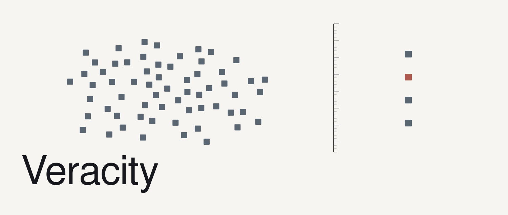

<p align="center">
  
</p>

<p align="center">
  <strong>Every finding your scanners reported, attributed to the change under review, with the evidence.</strong>
</p>

<p align="center">
  <a href="https://github.com/xxxquide/veracity/actions/workflows/ci.yml"></a>
  <a href="pyproject.toml"></a>
  <a href="LICENSE"></a>
  
  
</p>

---

Your scanners already work. CodeQL, Semgrep, Trivy, Gitleaks and OSV-Scanner will
happily tell you about four hundred findings in a repository. The question a
maintainer actually has on a pull request is narrower:

> Which of these does **this change** introduce, and what should I check before merging?

Veracity answers that. It reads the reports your scanners already produce,
attributes each finding to the change under review, and renders one Markdown
report with a verdict, a checklist and an evidence table. It is deterministic,
runs entirely locally, and needs no language model.

## What that looks like

The same one-file pull request, with a repository-wide `trivy fs` report supplied:

| | Naive: every finding is "this PR's problem" | Veracity |
|---|---|---|
| Verdict | `Review required` | `Ready for maintainer review` |
| Overall risk | High | Low |
| Checklist items | 61 | 0 |
| Report size | 50 639 chars | 24 483 chars |
| Findings held back as pre-existing | 0 | 65, listed separately with reasons |

All 61 vulnerabilities lived in `requirements.txt`, which the change never
touched. Change `requirements.txt` instead and the same report correctly returns
`Review required` at High risk, because then the dependency findings *are* in
scope.

## What it does

- **Reads real scanner output.** Native JSON and SARIF from Trivy, Semgrep,
  Gitleaks and OSV-Scanner, plus any SARIF 2.1.0 producer. Verified against the
  actual binaries — see the table below.
- **Attributes findings to the change.** Each finding carries `in_changed_scope`
  and a `scope_reason` saying why it was or was not counted.
- **Respects decisions you already made.** SARIF results with an accepted
  `suppressions` entry, or a `baselineState` of `unchanged`/`absent`, are
  excluded. A finding you dismissed does not come back every run.
- **Produces one report, not N comments.** Verdict, risk, confidence, decision
  guidance, maintainer checklist, evidence table, limitations — in that order, so
  a truncated GitHub comment loses the least important part rather than the most.
- **Fails loudly, never silently.** An unrecognised scanner payload raises
  `UnsupportedScannerInput`. "No findings" always means no findings, never "we
  could not parse your file".
- **Also does issue triage and release readiness** from local JSON feeds.
- **No runtime dependencies.** Python 3.11+ standard library only.

## Verified scanner support

The interesting claim any tool like this makes is *"we support scanner X"*. Here
that claim is a test. `tests/test_real_scanner_fidelity.py` runs against
byte-for-byte output from real binaries, checked into
`tests/fixtures/real-scanners/` and refreshable with `regenerate.sh`.

| Command | Version verified | Result |
|---|---|---|
| `trivy fs --scanners vuln,misconfig,secret --format json` | 0.73.0 | all four finding classes normalized |
| `trivy fs --format sarif` | 0.73.0 | via the SARIF adapter |
| `gitleaks dir --report-format json` | 8.30.1 | top-level array accepted |
| `gitleaks dir --report-format sarif` | 8.30.1 | via the SARIF adapter |
| `osv-scanner scan source --format json` | 2.4.0 | source path preserved |
| `osv-scanner scan source --format sarif` | 2.4.0 | via the SARIF adapter |
| `semgrep --json` | OSS | `check_id`, severity and CWE preserved |
| `semgrep --sarif` | OSS | via the SARIF adapter |

**CodeQL is covered by SARIF conformance tests, not by running CodeQL.** The
CodeQL-specific behaviour that is tested — the flat `problem.severity` key,
`security-severity` bands, `suppressions`, `baselineState`,
`partialFingerprints` and CWE tags — is asserted against SARIF constructed to the
shape GitHub documents. That is weaker evidence than the rows above, and it is
stated separately for that reason.

Prefer SARIF where a scanner offers it. It is the widest-covered path here, and it
carries suppressions, baseline state and fingerprints that native formats often
drop.

## How attribution works

A finding is **in scope** when any of these hold:

1. Its reported path is among the changed files.
2. A dependency or manifest file changed, and the finding is a dependency or
   license finding.
3. The scanner gave no repository path at all.

Rule 3 is deliberate. An unattributable finding is never silently demoted: if
Veracity cannot show a finding is unrelated, it keeps it. Findings that *are*
provably outside the change appear under `Pre-existing repository findings` with
the reason, and do not affect the verdict, risk level or checklist.

## Quick start

Requires Python 3.11 or newer.

```bash
pipx install git+https://github.com/xxxquide/veracity.git

vera demo               # a bundled scenario, end to end
vera init               # write a safe .veracity.toml
vera scanners           # which scanner families are covered
vera doctor             # check the local setup
```

From a checkout, `./vera demo` works without installing. Both `veracity` and the
short `vera` are installed as entry points.

Feed it your own data:

```bash
vera pr pull-request.json \
  --scanner trivy.json \
  --scanner semgrep.sarif \
  --scanner gitleaks.json
```

See the [CLI guide](docs/cli.md) and the [sample reports](examples/reports/).

## GitHub Action

Dry run by default. It posts nothing until you explicitly turn `dry-run` off and
`post-comment` on.

```yaml
name: Veracity

on:
  pull_request:
    types: [opened, synchronize, reopened, ready_for_review]

permissions:
  contents: read
  pull-requests: read

jobs:
  review:
    runs-on: ubuntu-latest
    steps:
      - uses: actions/checkout@v6
      - uses: actions/setup-python@v6
        with:
          python-version: "3.11"
      - uses: xxxquide/veracity@v0.4.0
        with:
          mode: analyze-pr
          dry-run: "true"
          post-comment: "false"
          fail-on-risk: none
```

Comment publishing uses one hidden marker, updates the existing marked comment,
skips identical reports, and never merges anything. See
[GitHub automation](docs/github-automation.md).

## Configuration

`.veracity.toml`, discovered in the working directory or passed with `--config`.
Defaults are deliberately conservative: dry run on, AI off, comment posting off,
draft and bot pull requests skipped, input size bounded.

```bash
vera config              # print a documented example
vera presets             # minimal | security | strict | docs
vera validate-config
```

Presets differ meaningfully rather than cosmetically: `minimal` has no policy
checks, `docs` has one, `security` has four non-blocking, `strict` has three of
four blocking. See [Configuration](docs/configuration.md) and
[Maintainer policies](docs/maintainer-policies.md).

## Optional language model

Off by default, and it cannot change anything that matters. The deterministic
verdict, risk level and blocking decisions are computed before any model is
called, and a model cannot alter them. Model text is sanitized — HTML comments
removed, Markdown headings flattened, length bounded — and rendered quoted, after
the deterministic sections, so it can never impersonate the evidence table. Claims
that reference evidence IDs which do not exist are discarded.

Run it without a model and you lose nothing but some wording. See
[Privacy and security](docs/privacy-and-security.md).

## What Veracity is not

- It is not a scanner. It explains the output of scanners you run.
- It does not prove your code is secure, and it will not find what your scanners
  missed.
- It does not replace human review, and it never merges.
- It does not phone home. No telemetry, no account, no hosted service.

## When to use something else

Honest comparisons, because these tools are good and they partly overlap:

| Want | Use |
|---|---|
| Findings as inline review comments on the diff, in any CI, for any forge | [reviewdog](https://github.com/reviewdog/reviewdog) — SARIF-native, `-filter-mode=added` scopes to the diff |
| Only-new-alerts triage inside GitHub's Security tab | GitHub code scanning — free for public repositories |
| Differential Semgrep runs | `semgrep --baseline-commit` |
| Merging, diffing or converting SARIF files as data | [microsoft/sarif-tools](https://github.com/microsoft/sarif-tools) |
| Vulnerability management across 150+ scanners for a security team | [DefectDojo](https://github.com/DefectDojo/django-DefectDojo) |
| A language model reviewing the code itself, free for open source | CodeRabbit, GitHub Copilot code review |

Veracity's narrower bet: one consolidated maintainer-facing verdict, attribution
explained per finding, no language model in the loop, and scanner support proven
against real binaries rather than asserted.

## Limitations

- Analysis is bounded on purpose. Files past `privacy.max_files_analyzed` and
  patch text past `privacy.max_diff_characters` are not read; when that happens,
  confidence is capped and the report says how much it skipped.
- Heuristics are heuristics. Test, documentation, dependency and
  security-sensitive classification is pattern-based and will sometimes be wrong.
  Every such claim carries the evidence it came from, so you can check it.
- Breaking-change detection is conservative: it needs a removed declaration, a
  deleted or renamed file, or an explicit marker. It will miss a signature change
  that only edits arguments.
- Release and issue analysis reads local JSON feeds, not live GitHub history.

## Development

```bash
python3 -m unittest discover -s tests -v      # 130 tests
python3 -m pip wheel . --no-deps
./vera verify
```

- [Documentation index](docs/README.md)
- [Architecture](docs/architecture.md) · [Development](docs/development.md) · [Roadmap](docs/roadmap.md)
- [Contributing](CONTRIBUTING.md) · [Security policy](SECURITY.md) · [Support](SUPPORT.md)

Focused, evidence-backed contributions are welcome — especially a real scanner
whose output Veracity gets wrong. Add its output to
`tests/fixtures/real-scanners/` and let the failing test make the case.

## License

Apache-2.0. Veracity is an aid for human maintainers. Its reports can be
incomplete or wrong and must not be treated as a security guarantee or an
automatic merge decision.
